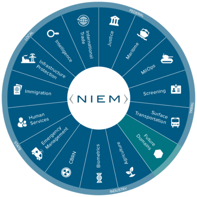
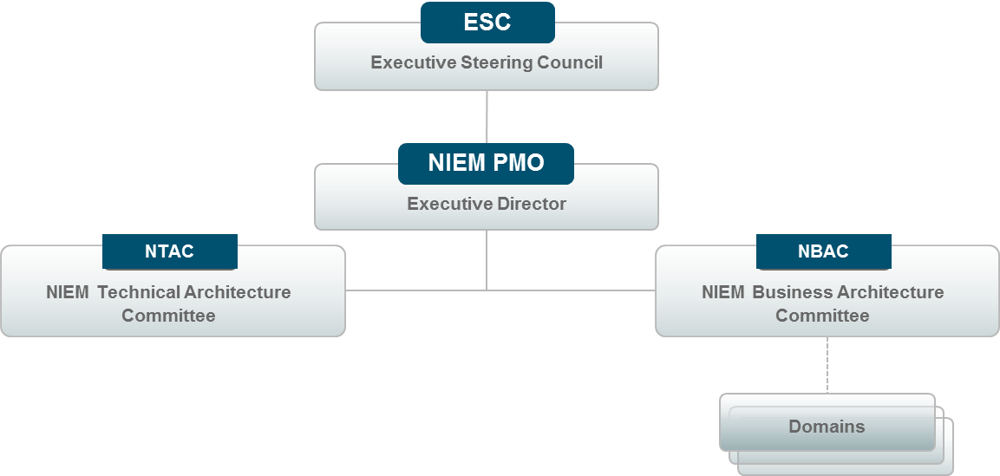

NIEM is the acronym for the *National Information Exchange
Model*. This implies that NIEM is a data model. While NIEM does in
fact have a data model, there is much more to NIEM than that. This
section will describe:

* [NIEM-based reusable data components](#components)
* the [NIEM data model](#model)
* the [NIEM process](#process)
* [NIEM technical specifications](#specifications)
* [NIEM governance](#gov)

It is best to think of NIEM as a community and standards-like organization
similar to the World Wide Web Consortium (W3C) or Open Geospatial Consortium
(OGC), whose members voluntarily cooperate to define and employ
its technical specifications, data model, etc. While there are of
course important differences, some illustrative parallels are:

| **Organization** | [NIEM](http://www.niem.gov) | [OGC](http://www.opengeospatial.org) |
| **Technical specifications** | [NIEM Naming and Design Rules](https://reference.niem.gov/niem/specification/naming-and-design-rules/), etc. | [Geography Markup Language (GML) Encoding Standard](http://portal.opengeospatial.org/files/?artifact_id=20509), etc. |
| **Data model** | [XML schemas for NIEM model](http://niem.github.io/niem-releases/), etc. | [XML schemas for GML](http://schemas.opengis.net/gml/3.2.1), etc. |

There are several ways to be a part of NIEM, ranging from merely using
a NIEM-based data resource specification, to participating in the
committees that create and control the NIEM products.

### Reusable data components {#components}

A data element combines a name, a definition, and a value domain (or
data type). For example:

* **Name**: PersonGivenName
* **Definition**: A first name of a person
* **Value domain**: *character string*

{: .callout} NIEM's reusable data components are
machine-readable data element definitions in different languages; XML
Schema, JSON Schema, and RDF. These components are like LEGO(tm)
blocks for data; developers choose the blocks they want and assemble
them into the data structure they are trying to create.

### The NIEM data model {#model}

Following the LEGO analogy, the NIEM data model is a generic box of
LEGO blocks that can be used to create many different LEGO
structures. The NIEM model is the collection of data components
created by the NIEM community, each created because it will be useful
in many different data resources. Developers look through the box,
choose those components that satisfy their business need, and leave
the rest behind.

{: .callout} The NIEM data model is not supposed
to be comprehensive. It is not the uber-model of everything for
everybody. Developers always leave some part of the NIEM model unused,
and developers almost always need to define data components of their
own for concepts that are not in the NIEM model. (They are encouraged,
but not required, to make those components available for others to
reuse.)

The NIEM model is partitioned into several subject-area domain models,
each managed by a separate domain community according to its
needs. There is also the *NIEM core*, which contains data components
thought useful and agreed by all the domain communities. The petal
diagram in this section illustrates the NIEM core and current
domains. (More on the model management process in [NIEM
governance](#gov).)

The NIEM model is published in two forms. The normative model is
currently published as a [collection of XML Schema
documents](https://release.niem.gov/niem/4.0/schemas.html ). There is
also a [spreadsheet
version](https://release.niem.gov/niem/4.0). Plans to
publish the model as JSON Schema and RDF are on the drawing board.

### The NIEM process {#process}

Developers use the NIEM process to define the syntax and semantics of
some data resource. That resource can be the data passed through an
API, or messages sent from one system to another, a data document
published on the web, etc. The process is:

1. Determine the information requirements. What are the facts to be
   conveyed in the data resource?

2. For each concept in the information requirements

   2.1 Search for and select a data component in the NIEM model to
   represent this concept. NIEM provides tools to assist with this
   search: the Subset Schema Generation Tool (SSGT) and Movement.

   2.2 Possibly adapt a data component from an external model, if
   there is no suitable component in the NIEM model. For example, the
   NIEM model provides several geospatial components adapted from
   Geographic Markup Language (GML).

   2.3 Define a new data component for the missing concept, if there
   is no component suitable for reuse. Developers may share their new
   component for reuse by others, but are not obligated to do so.

3. Have new or modified information requirements been revealed?
   Change the requirements in step #1 accordingly and repeat.

4. When all of the information requirements are satisfied, assemble
   the selected data components into a schema that specifies the data
   resource. This schema represents the resource's [content
   model](../../reference/models), which documents the meaning of each data
   component, defines which components are mandatory and optional, and
   may be used to validate individual instances of the resource during
   development or operations.

The schema is the central component of a NIEM-based data resource
specification, for historical reasons called the *Information Exchange
Package Documentation (IEPD)*. NIEM supplies an IEPD framework for
arranging documentation and gathering all of the artifacts needed by
developers and analysts. Any number of consumers can use the
specification to understand what to expect in the resource; any number
of producers can use it to know what they are expected to provide.

### NIEM Technical Specifications {#specifications}

LEGO blocks snap together only because of the precise size and
location of each block's pegs and cylinders. If the NIEM model is the
set of data blocks, then the NIEM technical specifications are the
rules which ensure that separately-developed blocks can be composed
into a single schema.

> XML is very flexible. Everyone can do their own thing, and, by
> golly, everyone is!
> -- Steve McVey at [XML '99](http://www.xml.com/pub/a/2000/02/23/ebiz/index.html)
{: .text-right}

At present most of the NIEM technical specifications are written
assuming XML as the data syntax and XML Schema as the primary
specification language. There are many, many different ways to
represent information with XML. A certain level of consistency is
required in order to compose many separately-designed XML data
components into a single resource specification that makes sense.

This consistency is accomplished by the [NIEM Naming and Design Rules
(NDR)](https://reference.niem.gov/niem/specification/naming-and-design-rules/),
which constrains the use of XML and XML Schema within NIEM.  Most of
the NDR rules are written in Schematron, and can be used to
automatically assess conformance of the schema in a resource
specification (an IEPD). The NDR also provides a meta-model for NIEM
XML, based on the Resource Description Framework (RDF), specifying how
XML elements and attributes equate to RDF resources, properties of
those resources, and values of those properties.

The technical specifications for NIEM JSON are now on the drawing
board. One thing already known: the NDR for NIEM JSON (if one is
actually required) can be much simpler than the XML rules. This is
because NIEM JSON is based on the
[JSON-LD](https://www.w3.org/TR/json-ld/) specification, which already
does for JSON much of what the existing NIEM NDR does for XML.

### NIEM Governance {#gov}

The NIEM data model is governed by the NIEM Domains and the NIEM
Business Architecture Committee (NBAC). The purpose is to create a
useful consensus model, with just the data elements that are likely to
be used in many exchange specifications, and just as much
harmonization as the community thinks worth doing. Domains are
organized by subject area, and are open to all interested parties,
with participation from US federal, state, local, and tribal
government, plus international and commercial members. The NBAC is
comprised of domain representatives who govern the NIEM core model.

The NIEM Technical Architecture Committee (NTAC) defines and supports
the technical architecture that governs NIEM; it documents,
implements, and maintains NIEM’s technical specifications.

Those bodies, the NTAC, the NBAC, and the Domains, comprise a voluntary
consensus standards body for the NIEM standards. They operate
according to the principles of openness, balance of interest, due
process, an appeals process, and consensus, as defined in [*ANSI
Essential Requirements*](https://share.ansi.org/shared%20documents/Standards%20Activities/American%20National%20Standards/Procedures,%20Guides,%20and%20Forms/2016_ANSI_Essential_Requirements.pdf).

There are also two administrative bodies above the level of standards
development. The NIEM Executive Steering Council (ESC) is the
decision-making body regarding membership, funding requirements,
program or technical direction, committee, and Program Management
Office (PMO) personnel appointments. The NIEM Program Management
Office (PMO) executes the vision of NIEM established by the Executive
Steering Council (ESC), while managing the day-to-day operations of
NIEM. The office encourages the adoption and use of NIEM and oversees
all working group and committee activities

### Ways To Use And Participate In NIEM {#participate}

At the simplest level, data scientists and software developers use a
specification constructed through the NIEM process as documentation
for a data resource they need to produce or consume. In this case the
users need not be aware of NIEM at all.  For example, the [Automated
Secure Alarm Protocol
(ASAP)](https://apcointl.org/resources/interoperability/asap.html) is
an ANSI standard that is used for machine-to-machine communication
data between alarm monitoring companies and 911 centers. Its data
format is NIEM-conforming and was created through the NIEM process,
but software developers building applications for the protocol do not
have to know or care about that. They only have to produce or consume
data that conforms to the specification.

The next level of NIEM use is to reuse NIEM components for one portion
of a data resource. This treats the NIEM model as just another data
vocabulary among others, such as Dublin Core and schema.org.

Scientists and developers may create their own NIEM-based
specification to document a data resource they produce. In this case
all of the data components will be NIEM-conforming, whether reused
from the NIEM model, adapted from another standard, or created from
scratch.

Several scientist/developer teams may form a community to create a
data resource specification as the standard for data they all produce
and consume. Or they may agree on a set of data components they will
all use, while not attempting to standardize each complete
resource. This is very similar to a NIEM domain's activity. The new
community may seek recognition as a new domain, or affiliation with an
existing domain, but is not required to do so.

Scientists and developers can participate in a NIEM domain's activities,
proposing new and modified data elements in the domain submodel for use in
multiple specifications. A representative from a NIEM domain will act as a
voting member of the NIEM Business Architecture Committee (NBAC). The NBAC
governs the NIEM core model; work here often involves harmonizing data
definitions among the domain models to create elements that can be used in any
domain. An individual may also be invited to participate in the NBAC as a
non-voting observer.

### Summary

This page describes those aspects of the NIEM organization, model,
process, and technical specifications that are most relevant to NIEM
JSON. Much more information about NIEM is available at the
[niem.gov](https://www.niem.gov) website.

