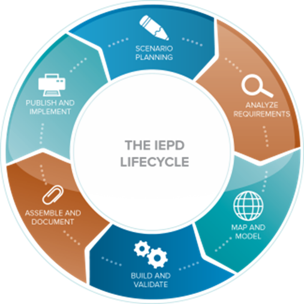

{{ page.description}}

## IEPD Lifecycle

1. **[Scenario Planning](scenario-planning/ "Scenario Planning")**: During the Scenario Planning phase, you review background information related to your information exchange, assess resource impact, understand business context, and identify information exchange business scenarios.
1. **[Analyze Requirements](analyze-requirements/ "Analyze Requirements")**: During the Analyze Requirements phase, the selected information exchange scenario is further elaborated to understand and document the business context and data requirements.
1. **[Map and Model](map-and-model/ "Map and Model")**: During the Map and Model phase, you begin the creation of IEPD components for your exchange content model based on your information exchange requirements.  You start with the mapping document, which matches your exchange data elements to the NIEM data model.
1. **[Build and Validate](build-and-validate/ "Build and Validate")**: During the Build and Validate phase, you create a set of exchange-specific, NIEM-conformant XML schemas that implement the exchange content model created for the exchange and validate them. Components in this phase also include other XML documents generated from NIEM tools (e.g., Wantlist).
1. **[Assemble and Document](assemble-and-document/ "Assemble and Document")**: During the Assemble and Document Phase, you prepare and package all related files for the IEPD into a single, self‐contained, self-documented, portable archive file. You then should perform a peer review to ensure artifact consistency within the IEPD and with other IEPDs.
1. **[Publish and Implement](publish-and-implement/ "Publish and Implement")**: During the last phase, the Publish and Implement phase, you implement the IEPD into production and publish the IEPD for search, discovery, and reuse.

## General Resources for IEPD Developers



## Tools for IEPD Developers

See the [NIEM Tools Catalog](https://www.niem.gov/tools-catalog) for information about community and commercially-available tools.

| Tool | IEPD Developer Uses |
| ---- | ----------- |
| **[SSGT](/reference/tools/ssgt)** | Search and view the content of the model.   Build XML Schema subsets to use with your XML-based IEPD. |
| **[Movement](/reference/tools/movement)** | Search and view the content of the model in the new and easy-to-use open-source tool.   Build simplified JSON Schema subsets to use with your JSON-based IEPD. |
| **[ConTesA](/reference/tools/contesa)** | Check your XML extension schemas for NDR conformance errors and warnings. |
| **[Migration Tool](/reference/tools/migration)** | Migrate your NIEM XML schema subsets to a subsequent release. |

## Artifacts for IEPD Developers

| Artifact | IEPD Developer Uses |
| -------- | ------------------- |
| **[Code Lists](/reference/artifacts/code-lists)** | Define enhanced code lists for an exchange. Specify static bindings for NIEM code lists (e.g., GENC). |
| **[Reference Schema](/reference/artifacts/reference-schema-document)** | Normalize broadly reuseable schema components relevant to future IEPDs. |
| **[Extension Schema](/reference/artifacts/extension-schema-document)** | Create new data types or elements needed for the specific exchange. |
| **[Subset Schema](/reference/artifacts/subset-schema-document)** | Create a smaller, self-consistent, schema document as the basis for extensions or data within an exchange. |
| **[Schema Document Set](/reference/artifacts/schema-document-set)** | Compose a collection of schema documents necessary for validating IEPs derived from the conformant IEPD |

## Specifications for IEPD Developers

| Specification | IEPD Developer Uses |
| ------------- | ----------- |
| NDR | Information about the NIEM **[Naming and Design Rules specification]({{ site.data.links.ndr }})** is coming soon. |
| MPD | Information about the **[Model Package Description specification]({{ site.data.links.mpd }})**, which provides rules and guidance for developing IEPDs, is coming soon. |
| **[Code Lists](/reference/specifications/code-lists)** | Want to use CSV files to define your IEPD codes instead of XML enumerations?   Want to link codes to other codes (like vehicle makes and models) or multiple definitions?   Want to use GENC codes from the release?   Learn how NIEM uses CSV files to represent enhanced code lists. |
| Conformance | Information about the **[Conformance specification]({{ site.data.links.conformance }})** is coming soon. |
| Conformance Targets Attribute | Learn how to declare conformance targets for your extension schemas.   This is most often used to specify that your IEPD schemas intend to follow a particular version and rule set of the NDR (e.g., NDR version 4.0, extension schema rules).   Information about the **[Conformance Targets Attribute specification]({{ site.data.links.ctas }})** is coming soon. |
| Schematron in XML | Information about **[Embedding Schematron in XML Schema Documents specification]({{ site.data.links.six }})** is coming soon.|