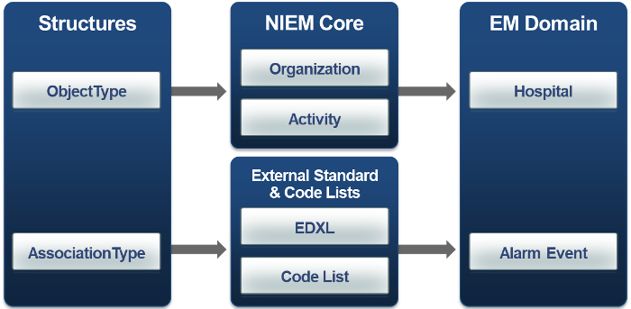
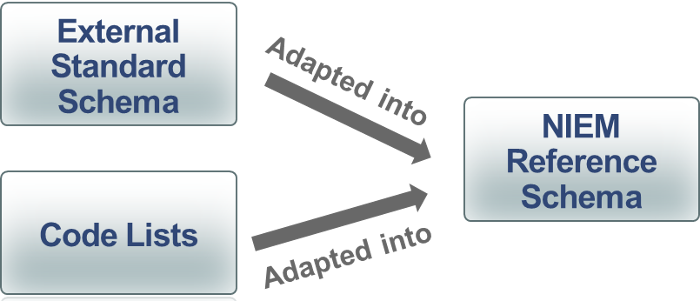

## Support Abstraction Layer

The schemas within the Support Abstraction Layer provide the underlying standardized structure for data objects in NIEM.  

Each of the data objects in the other abstraction layers reuse the basic data objects in the Support Layer.

| **structures** | Contains NIEM base types to provide a set of generic types from which all types should derive. |
| **appinfo** | Contains definitions used in high-level data modeling and also for validation of NIEM-conformant instances. |

## NIEM Core Abstraction Layer

The NIEM Core Abstraction Layer contains the following reference schemas:

- NIEM Core
- Code tables that are part of NIEM Core

NIEM Core contains commonly used definitions for generic objects like person, organization,and activity that are used across domains.

- Objects defined in NIEM Core leverage base NIEM XML objects defined in the proxy and structures schemas.
- Objects defined in NIEM Core can be used as base objects for definitions in domain-specific schemas as well as extension schemas.

## Domain Abstraction Layer

The Domain Abstraction Layer provides a mission-based and domain-specific layer of data objects that specialize base objects from the NIEM Core and structures namespaces.

## External Standards and Code lists Abstraction Layer

The External Standards and Code Lists Layer contains definitions for objects used in standards defined external to NIEM. External standards are integrated into NIEM through the schemas in this abstraction layer.

As new standards are recognized for compatibility with NIEM, additional reference schemas are added to this layer.

