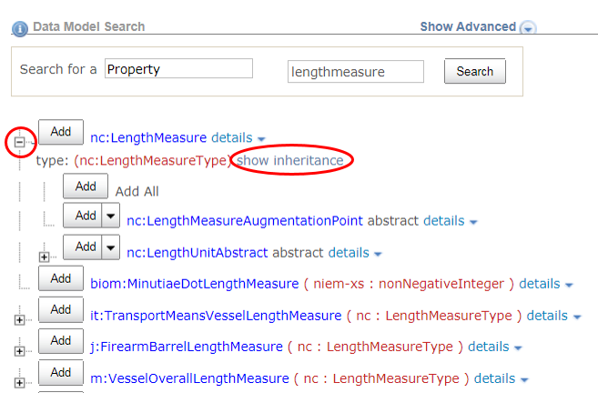
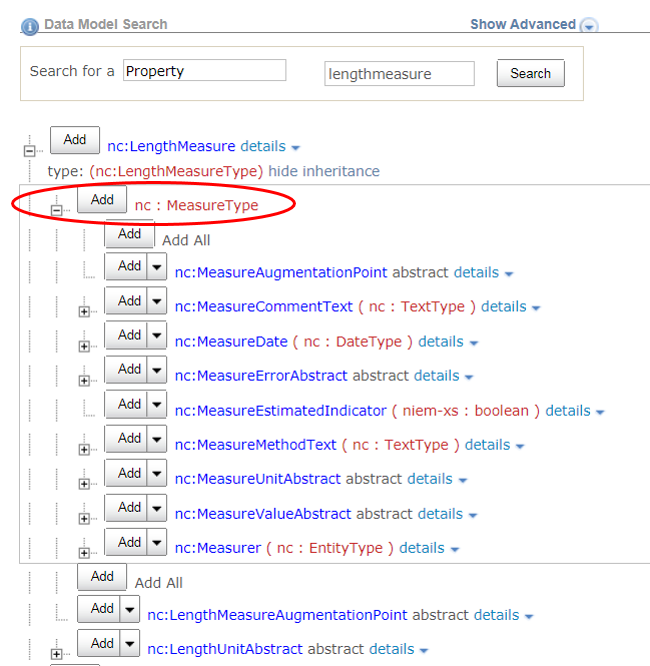
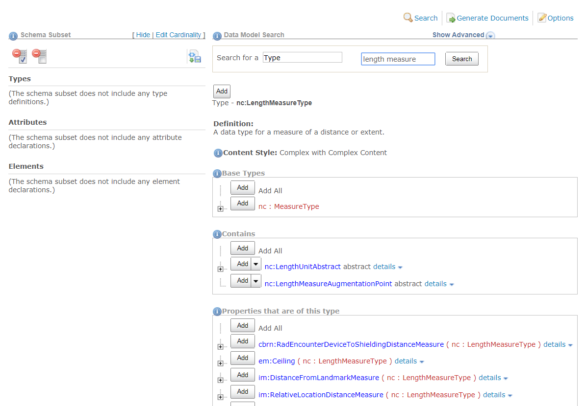

The properties and types displayed in the search results are hyperlinked to display more detailed information about each component. This helps users navigate through the data model to find associated properties and to explore the model hierarchy.

Some additional information about properties and types may be viewed directly from the search results list.  More detailed information will be available by clicking on the property or type link to open the page for that component.

## Search Results Page

### Definitions

There are two ways to view the definition of a property or type from the search results page:

- Hover over a property or type link to see the definition for that component.
- Toggle the **`details`** link to show/hide definition.  Multiple details panels may be open at the same time.

{:.bordered}

### Sub-properties

In the list of search results, click the **`+`** button to the left of the component to see the sub-properties that the type contains.

{:.example}
> View the list of sub-properties for **`nc:LengthMeasure`:

{:.bordered}

Once the sub-property list is expanded, a **`show inheritance`** link will appear if the type extends another type with sub-properties.

{:.bordered}

Each parent type may also be expanded to display their sub-properties.

{:.example}
> After clicking **`show inheritance`** and the expand button, the list of sub-properties for **`nc:MeasureType`** (the parent type for **`nc:LengthMeasureType`**) is displayed.  These properties will be inherited:

{:.bordered}

### Substitutions

For abstract elements, click the **`+`** button to view a list of available substitutions.

{:.bordered}

## Property Page

Clicking on a property link will take you to a page with more information about that property.  Commonly available information includes the definition, the type of the property, and any types that the property may be contained in.

{:.example}
> Page for property **`nc:PersonName`**

{:.bordered}

## Type Page

Clicking on a type link will take you to a page with more information about that type, including the definition, the kind of type it is, the parent or base type, and any elements of this type.

Further information on the page will vary based on what kind of type it is.  The page may display a list of sub-properties, codes, or other facets, as applicable.

{:.example}
> Page for type **`nc:LengthMeasureType`** (type contains sub-properties)

{:.bordered}

{:.example}
> Page for type **`unece:LengthCodeSimpleType`** (type contains codes)

{:.bordered}
