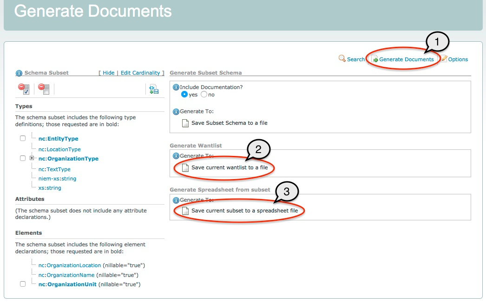

- TOC
{:toc}

## Overview

In addition to exploring the content of NIEM releases, the SSGT may also be used to build subsets of NIEM releases.  Users may select elements, attributes, and types directly from a list of search results, or from the property and type pages, and add them to the subset list on the left of the page.

{:.example}
> The example below shows an empty subset.  No types, attributes, or elements have been added yet.

{:.bordered}

The SSGT will automatically calculate all required dependencies whenever a component is added to the subset list.

- User-selected components will appear in bold font in the subset panel.
- Dependencies will appear in regular font.

If a user later removes a selected component, dependencies that are no longer necessary will also be removed.

{:.note}
> This tool does not have user accounts.  To save your work, you must download a **wantlist** file (a SSGT-generated XML file with a list of user-selected components).  This file can later be uploaded to the SSGT to resume work on the subset.  See below for ways to generate a wantlist.

## Adding Components

### Independently

- Click the **`Add`** button next to the element or type name.
- The component will be added to the appropriate section in the subset list on the left, in bold font to indicate a user-selection.
- Any dependencies the component may have will also be added to the subset list, in regular font.

{:.example}
- In the example below, element **`nc:OrganizationUnit`** is being added to an existing subset that also contains element `nc:OrganizationName`.
- (1) User adds the element to the subset.
- (2) The SSGT adds the selected component to the subset list on the left.
- (3) The SSGT also adds dependencies to the subset list (the type of the element: `nc:OrganizationType`)

{:.bordered}

### As Sub-Properties

In order to add an element or attribute to a subset as a sub-property of a type, this relationship must be captured explicitly.  The SSGT will not do this automatically.  Many properties belong to more than one type; other times a property may be added to a new type in an exchange.

{:.note}
> Any easy way to tell if a property is going to be added as a sub-property is to look at the `Add` button.  For sub-properties, it also includes a drop-down icon on the right side of the button to allow users to set sub-property options.  Other `Add` buttons do not have this drop-drown.

From search results:

- Click the `+` icon next to a component to expand the list of sub-properties.
- From the sub-property list, click the **`Add`** button next to the property name.
- The property will be added to the appropriate `Elements` or `Attributes` section of the subset list on the left.
- The type, in not already in the subset, will be added to the `Types` section of the subset list on the left.
  - You can click the `+` icon next to the type in the subset list to view all of its sub-properties in the subset.

{:example}
- In the example below, element **`nc:OrganizationLocation`** is being added to the subset as a sub-property of type **`nc:OrganizationType`**.
- (1) User expands the list of sub-properties for type `nc:OrganizationType`.
- (2) User adds element `nc:OrganizationLocation` to the subset as a sub-property of `nc:OrganizationType`.
- (3) The SSGT adds the element to the subset list.
- (4) The SSGT adds the type to the subset list along with its sub-property.

{:.bordered}

{:.note}
> Adding sub-properties to a type will happen automatically for any property added to a subset from a type page, in the `Contains` section.

### All sub-properties

A user can add all sub-properties of a type.

- Click the `+` icon next to a component to expand the list of sub-properties.
- From the sub-property list, click the **`Add`** button next to **`Add All`** label.  This will appear above the list of sub-properties.
- The property will be added to the appropriate `Elements` or `Attributes` section of the subset list on the left.
- The type, in not already in the subset, will be added to the `Types` section of the subset list on the left.

{:.note}
> This action affects only the designated type.  Any new type added to the subset through this action will be added empty.  Users will need to add individual or all sub-properties to as needed.

{:.example}
- In the example below, all sub-properties of type **`nc:OrganizationType`** are being added to the subset.
- (1) User expands the list of sub-properties for type `nc:OrganizationType`.
- (2) User clicks the `Add` button for `Add All`.
- (3) The SSGT adds the type and all sub-properties to the subset list on the left.
- (4) The SSGT adds the sub-properties to the Elements section of the subset list.

{:.bordered}

## Modify the subset

### Remove components

Properties and types may be removed from a subset.

- Mark the checkbox next to the appropriate property, type, or sub-property in the subset list on the left.
- Click the **`Delete`** button to remove all of the selections and dependencies from the subset.

{:.bordered}

{:.note}
> If no checkbox is available next to the component, that is because it is a dependency and cannot be removed manually as long as the other component(s) that require it are still in the subset.

### Remove all

An entire subset may be removed.

- Click the **`Clear Subset`** button.

{:.bordered}

## Generate

### Subset schemas

- Click `Generate Documents`.
- Toggle the `Include Documentation?` radio button to either include or remove component definitions.
  - By default, this button will be checked `yes` and definitions will be included.
  - Set this to `no` if needed to minimize the size of the resulting schemas.
- Click the link to `Save Subset Schema to a file` to generate and download a zip file containing the subset schemas.

This subset will include a wantlist (wantlist.xml) in the zip file so that it can be loaded in the SSGT at a later date to resume work on the subset.

### Wantlist

A wantlist can be generated without the full subset package as a way to save work.

- Click `Generate Documents`.
- Click "Save current wantlist to file".

### Spreadsheet

Generate a spreadsheet representation of the subset:

- Click `Generate Documents`.
- Click "Save current wantlist to file".
