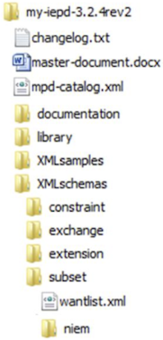

{{ page.description}}



You have all your schemas and supporting documentation ready. Now you need to gather all of it in one electronic package.

## Mandatory IEPD Artifacts

The following table lists the documents (artifacts) you must have in an IEPD. All of them must be NIEM-conformant.

| Artifact | Mandatory (Y/N) | Description |
| --- | :---: | --- |
| Subset Schemas | Y | The subset schemas can be generated by the SSGT from a variety of inputs (e.g., wantlists, XML files). It should always validate against the entire reference schema. |
| Exchange Schema | Y | An exchange schema defines the root (highest level) element of the exchange, as well as any other content specific to an IEPD that will not be reused by other IEPDs. It imports, reuses, and arranges the data objects from other schemas in the exchange. It is unique to each exchange, and when it is reused from existing exchanges, it can provide a template for the structure and content of the new exchange schema. An IEPD may have multiple exchange schemas because multiple information exchanges may be documented through a single IEPD where each information exchange has its own exchange schema, but shares a common extension schema. |
| Sample Instance | Y | A sample XML instance is defined as the exchange message  "payload" and validates against the IEPD schemas. Various tools can generate XML instances based on XML schemas, but the instances can only be created once all schemas have been generated. Schema validation tools can be used to test XML Instances against the NIEM schemas. XML instances should be validated against both "paths" via the subset schemas and the constraint schemas (if applicable). |
| XML Catalog | Y | The catalog is an XML file that contains the metadata for an IEPD’s unique identification, basic descriptive characteristics, directory structure and artifacts, and lineage and relationships to other IEPDs. The metadata is the minimal information required to facilitate human understanding, tool support, and machine processing. |
| Change Log | Y | The change log is a record of cumulative changes from previous IEPD versions. The initial change log records its creation date. |
| Readme | Y | Readme is a text file that provides introductory information about the IEPD.  It lists and provides detailed information for the the IEPD artifacts. This is the file you usually want to read first. |

### Readme

As a starting point, logically organize the readme document in chronological order of the development artifacts. Existing IEPD master documents can be used as a general guide. The document should not include XML code.

{:.example}
>This can be a simple text file.
>
>1. Executive Summary
>1. [Name] Information Exchange
>       - Overview of the [Name] Exchange
>       - Exchange Partner Interaction
>1. Business Models
>1. Business Rules and Requirement
>1. Exchange Content Model
>1. Development Information
>       - IEPD Definition
>       - Tools and Methodologies
>       - Testing and Conformance
>1. Appendices
>       - List of IEPD Artifacts
>       - IEPD Catalog

### Change Log

{:.example}
>This can be a simple text file.
>
>| Version | Date | Description | Author |
>| --- | --- | --- | --- |
>| 1.0 | 2/2/03 | Original Version | Bob |
>| 1.1 | 4/16/03 | Added new elements to subset schema. | Bill |
>| 2.0 | 5/9/18 | Updated requirements and constraint schema. | Sara |

## Recommended IEPD Artifacts

The following table lists artifacts that we recommend you include in an IEPD.  All of them must be NIEM-conformant.

| Artifact | Mandatory (Y/N) | Description |
| --- | :---: | --- |
| Constraint Schema | N | A constraint schema is from a subset schema and reflects the business rules of the exchange. If a separate schema is developed, an additional validation path is needed to validate against the constraint schema. |
| Extension Schema | N | An extension schema defines exchange-specific types, elements, and attributes not available within NIEM. The extension schema may also include reusable data components for a given exchange with the consideration that if the data objects in the extension schema will be reused, it is better to have a separate schema and local namespace defined for that schema. Exchange schemas cannot be reused effectively between information exchanges because they contain the root element of the information exchange, which is unique to each individual exchange. |
| Conformance Assertion | N | A document that declares the IEPD conforms to relevant NIEM specifications and associated rules. |
| Wantlist | N | A wantlist is an XML file that contains the elements and types from NIEM that will be included within the subset schema for the exchange. In other words, it describes what an exchange "wants" from the NIEM data model. You can create one manually or use a tool such as the SSGT, which can create a wantlist, or generate a subset schema based on an existing wantlist. Thus the wantlist can be an output that serves as an IEPD artifact, or it can be the input to generate an expanded wantlist. Although it is not required, you should include a wantlist in the package.|
| Stylesheet | N | A stylesheet, built with eXtensible Stylesheet Language (XSL), makes an XML instance and catalog human (or browser) readable. No universal guidance exists for the formatting or inclusion of XML stylesheets in IEPDs. Sample XML instances for an exchange should be linked to the stylesheet in order to view the instances in a more consistent and presentable format. The IEPD catalog should be linked to a stylesheet in order to view catalog metadata in a more consistent and presentable format. A catalog stylesheet example (mpd-catalog.xsl) can be found at [Catalog Stylesheet Example](http://reference.niem.gov/niem/resource/mpd/catalog/1.0/example/ "Catalog Stylesheet Example"). |
| Code List | N | A code list is an XML schema of allowable values for a data element within an exchange. The Code List Generator (CLG) is useful for uploading a template-based value list and generating a NIEM-conformant representation of the code list. The list can be manually created from previously developed XML schemas with XML code inserted through the use of enumeration facets. |
| Business Rules | N | Text or machine-readable statements that describe business policy or procedure, and thus define or constrain some aspect of a process or procedure in order to impose control. |

## Assemble the IEPD

Once all IEPD artifacts have been compiled, the next step is to properly name, file, and archive the final package.

A standardized file structure promotes consistency and creates logical navigation through a large number of IEPD artifacts. Moreover, this consistency enables a greater degree of discovery and IEPD reuse because you can easily access information in a structured and uniform manner. Note that the catalog enables IEPD developers to locate artifacts in a directory and label them as specific IEPD artifacts no matter where they exist in the package.

1. **Name** each artifact for your exchange with a consistent naming convention.
1. **File** each artifact in a logical, consistent folder structure.
1. **Archive** (e.g., zip) the file structure, including artifacts, into the final package.

The following illustration shows a recommended IEPD folder structure. Note that the documentation produced by the SSGT creates most of the structure for you.

## Review the IEPD

You should perform a peer review of your IEPD. This has several benefits:

- Maintains consistent quality of artifact content and presentation.
- Decreases the occurrence of published IEPDs that are difficult to reuse.
- Peer participation in a review also increases individual knowledge of information exchanges and promotes accountability in verifying that the exchange meets established requirements.

A good way to review an IEPD is to compare it to a checklist. The checklist should include the following:

- The readme document contains documentation necessary to effectively describe the information exchange.
- The exchange content model file is included and accurately represents the XML code in the schemas.
- The XML catalog validates with the NIEM Model Package Description (MPD) catalog schema (XSD) and resides in the root directory of the MPD bearing the file name “mpd-catalog.xml.”
- The change log is in the root directory of the IEPD, begins with the substring “changelog,” and records changes to previous IEPD schemas that are represented.
