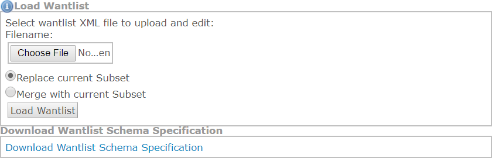
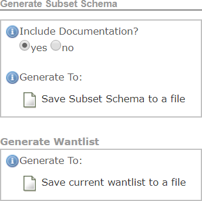

{{ page.description}}



# Create XML Schemas and Artifacts

Data objects identified in the mapping document will appear in either the exchange, extension, or subset schemas. Associations and cardinality from the exchange content model will be reflected in XML schemas.

## NIEM-Conformant XML Schema Generation

XML schemas that are typically created for an IEPD include subset, exchange, extension, constraint, and reference. A NIEM-conformant IEPD is required to constrain at least one schema that is either a NIEM reference schema or subset schema. XML schemas for NIEM-conformant exchanges can be created in two ways:

| Method | Process |
| --- | ---|
| Generation Through Tools | Automatically generate schemas based on an exchange content model, mapping document, or other inputs. |
| Coded by Hand | Start with existing schemas or NIEM schema templates, which can be derived from NIEM reference schemas. |

It is recommended that you start with tools and modify as needed.

### The NIEM Tools Catalog

The NIEM Tools catalog provides a marketplace for a number of different tools that aid in schema generation. The **Code List Generator**, for example, provides you with the ability to build an XML schema file for code sets from an Excel spreadsheet.

The NIEM Tools Catalog resides at [NIEM Tools Catalog](https://www.niem.gov/tools-catalog "NIEM Tools Catalog").

The Code List Generator resides at [Code List Generator Tool](https://www.niem.gov/CLG "Code List Generator Tool")

### Create a Subset Schema

Subset schemas are constructed by reusing the elements and types needed for the exchange from NIEM reference schemas.

### Subset Schema Considerations

- A subset schema is a required artifact of an IEPD and should be NIEM-conformant.

- A subset schema should always validate against the entire reference schema.

- A subset schema can be generated using a number of tools from a variety of inputs (e.g., Wantlists, XMI files).

### Subset Schema Generation Tool (SSGT)

The Subset Schema Generation Tool (SSGT) is a common starting point for schema development because it is free, easy to use, and produces Subset Schemas for use within an exchange. The SSGT can also be used for searching and browsing the NIEM data model and generating Wantlists.

### Wantlist

A Wantlist is essentially an XML file that describes what an exchange “wants” from the NIEM data model. It directly aligns to the subset schema. SSGT also provides the functionality to generate a subset schema based on a Wantlist.

#### Using a Wantlist

Wantlists are primarily used to generate a subset schema for a particular information exchange. Elements and types that have been mapped to NIEM are included as part of the wantlist. The types and elements that are part of the wantlist represent those elements that are going to be part of the subset schema.

### Wantlist Procedure

1. Load Wantlist into SSGT. 

1. Generate Subset Schema. 

### Constraint Schemas

Constraint schemas add additional restrictions to elements and types in the exchange with the following considerations:

- They are not a required artifact of an IEPD and do not have to be NIEM-conformant.

- They are derived from Subset Schemas.

- They reflect the business rules of the exchange.

If a separate schema is developed, an additional validation path is needed to validate against the Constraint Schema.

### Extension Schemas

Extension Schemas define exchange specific types, elements, and attributes not available within NIEM. The Extension Schema also includes reusable data components for a given exchange with the following considerations:

- They are not a required artifact of an IEPD (it is possible for an IEPD to just have an Exchange Schema and a Subset Schema).

- If the data objects in the Extension Schema will be reused, it is better to have a separate schema and local namespace defined for that schema.

- Exchange Schemas cannot be reused effectively between information exchanges because they contain the root element of the information exchange, which is unique to each individual exchange.

### Exchange Schemas

An Exchange Schema defines the root (highest level) element of the exchange, as well as any other content specific to this IEPD that will not be reused by other IEPDs. It has the following chararacteristics:

- It is required in an IEPD.

- It imports, reuses, and arranges the data objects from other schemas in the exchange.

- It is unique to each exchange.

- When it is reused from existing exchanges, it can provide a template for the structure and content of the new exchange schema.

{:.note}
> An IEPD may have multiple exchange schemas. This is due to the fact that multiple information exchanges may be documented through a single IEPD where each information exchange has its own exchange schema, but shares a common extension schema.

### Recommended Additional XML Artifacats

In addition to exchange, extension, subset, and constraint schemas, there are four additional XML artifacts that you should include within an IEPD. These are labeled “XML Artifacts” because they are not part of the four major schemas included in an IEPD, covered previously. However, they are highly recommended. The file extensions on these “artifacts” include XML, XSD, and XSL; therefore, not all of these artifacts are XML schema (XSD).

| Artifact | Description |
| --- | --- |
| Wantlists | An XML file that contains the elements and types from NIEM that will be included within the Subset Schema for the exchange. |
| Stylesheets | A stylesheet is built using eXtensible Stylesheet Language (XSL) and is used to make an XML instance human (or browser) readable. |
| Instances | A sample XML instance is defined as the exchange message  “payload” and validates against the IEPD schemas. |
| Code Lists | An XML schema of a list of allowable values for a data element within an exchange. |

### Create a Wantlist

Wantlists can be created in two ways. Wantlists created in either manner can also be included in the IEPD.

- **Automatically generated** - When using most NIEM tools, wantlists can automatically be generated and downloaded for inclusion in an IEPD. Wantlists can be either an input or an output to the generation process.

- **Manually created** - Wantlists can be created by hand and used to structure the Subset Schema generation process.

### Create an XML Instance

Various XML editing tools exist that can generate XML Instances based on XML schemas.

{:.note}
>
>- XML Instances are required IEPD artifacts.
>
>- XML Instances can only be created once all schemas have been generated.

#### XML Instance Recommendations

- Schema validation tools can be used to test XML Instances against the NIEM schemas.

- XML Instances should be validated against both “paths” via the subset schemas and the constraint schemas (if applicable).

### Create an XML Stylesheet

Stylesheets are commonly added to IEPDs to provide readability to the XML instance document(s) and IEPD catalog.

{:.note}
>
>- Stylesheets are **not** required IEPD artifacts.
>
>- No universal guidance exists for the formatting or inclusion of XML stylesheets in IEPDs.

#### Stylesheet Recommendations

- Stylesheets should be included in the IEPD so that people viewing the IEPD do not have to read through raw XML to view a sample instance document or view the IEPD Catalog.

- Sample XML instances for an exchange should be linked to the stylesheet in order to view the instances in a more consistent and presentable format.

- The IEPD catalog should be linked to a stylesheet in order to view catalog metadata in a more consistent and presentable format.

- A catalog stylesheet example (mpd-catalog.xsl) can be found at [Catalog Stylesheet Example](http://reference.niem.gov/niem/resource/mpd/catalog/1.0/example/ "Catalog Stylesheet Example").

### Create a Code List

Code Lists are a part of XML schemas that can be created in two ways:

- **Automatically generated** - A spreadsheet of code list values created by the user, based on a template, can be uploaded to the Code List Generation tool to generate a NIEM-conformant representation of the code list. The spreadsheet template used by the Code List Generation Tool can be found in the NIEM.gov Tools Catalog.

- **Manually created** - Code Lists are created by using previously developed XML schemas and inserting XML code through the use of enumeration facets.

## Validate XML Schemas

### XML Schema Conformance

Conformance is the adherence to predefined rules and guidelines as defined in the NIEM Naming and Design Rules (NDR) and Model Package Description (MPD) Specification. The NDR provides other general conformance guidelines and principles.

{:.note}
>
>- NIEM conformance promotes increased levels of interoperability and reuse within exchanges.
>- NIEM conformance adheres to W3C specifications for valid, well-formed XML Schemas.
>- NIEM conformance applies mainly to reference, exchange and extension schemas, as well as XML instances as defined by the NDR.
>- XML Schemas need to be checked for conformance both by hand and through the use of tools since currently no tool exists that automates all of the NDR rules.

### XML Instance Validation

Schemas must be validated in order to be conformant. Validation promotes conformance through the process of testing XML to create well-formed and NIEM-conformant schemas. You can leverage NIEM tools, such as the SSGT, to make the validation process easier.

{:.note}
>
>- XML Instances must validate against the XML schemas used within an exchange.
>- Each XML element must validate against the schema definition of that element.
>- XML Instances MAY be validated through multiple schema validation passes, using multiple schemas for a single namespace.

#### Conformance Validation Tool

The NIEM Conformance Tool is an available option to validate schema. This tool allows you to upload an IEPD, a set of schemas in a zip file, or an individual schema.

{:.note}
>Source:  NIEM Tools Website
>- The tool uses Schematron language to directly check against the latest version of the NIEM NDR. It does not check all NDR rules as some rules are subject to interpretation.
>- It provides a summary report that contains a list of the NDR rules that were checked with those that passed and those that failed.
>- It indicates which rules have to be manually checked.
>- It is available for evaluation and feedback purposes only; it is not the measure for NIEM conformance.
>- It is intended to assist developers by automatically identifying potential locations of non-conformance within IEPD artifacts (e.g., schemas, catalog, xml) using the latest published NIEM specifications.

#### Resolve Validation Errors

The Conformance Validation Tool provides a summary report that lists the location of schema failures by line number and by XML object name. You should then do the following:

1. Resolve each validation error by reviewing the location of the error within the schema and the NDR rule(s) that was broken for that error.

1. Make modifications to the appropriate schema to address each validation error.

1. Run each schema through the Conformance Validation Tool to check for NIEM conformance.

1. Repeat the previous steps until all conformance errors have been resolved.

{:.note}
> Contact the NIEM Help Desk at NIEM.gov/contactus if you are unable to resolve conformance errors or need additional assistance.

#### Manual Review Process

Do a manual review of each schema to address the NDR rules not checked within the Conformance Validation Tool. Manual review of schemas for NDR conformance is always necessary to verify conformance. Use the following steps:

1. Review the summary report from the Conformance Validation Tool to identify the NDR rules not checked through the tool.

1. Analyze each schema for adherence to each of the NDR rules that were not checked within the Conformance Validation Tool.

1. Make the appropriate changes to the schema(s) to resolve each issue per mistakes made in the manual review.

1. Validate the schemas again in the Conformance Validation Tool.

