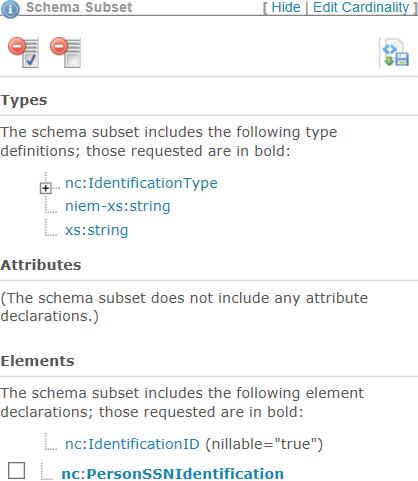
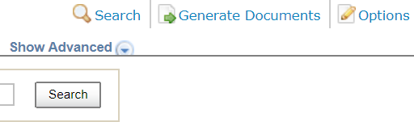
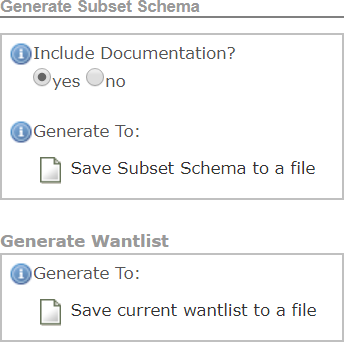
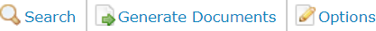

{{ page.description}}



Data objects identified in the mapping document appear in either the exchange, extension, or subset schemas. Associations and cardinality from the exchange content model are reflected in XML schemas.

## NIEM-Conformant XML Schema Generation

XML schemas that are typically created for an IEPD include subset, exchange, extension, constraint, and reference. A NIEM-conformant IEPD is required to constrain at least one schema that is either a NIEM reference schema or subset schema. XML schemas for NIEM-conformant exchanges can be created in two ways:

| Method | Process |
| --- | ---|
| Generation Through Tools | Automatically generate schemas based on an exchange content model, mapping document, or other inputs. |
| Coded by Hand | Start with existing schemas or NIEM schema templates, which can be derived from NIEM reference schemas. |

It is recommended that you start with tools and modify as needed.

### The NIEM Tools Catalog

The NIEM Tools catalog is a collection of different tools that aid in schema generation. The Code List Generator (CLG), for example, provides you with the ability to build an XML schema file for code sets from an Excel spreadsheet. The Subset Schema Generation Tool (SSGT) is often used to start schema development because it is easy to use and produces subset schemas for use within an exchange. The SSGT can also be used for searching and browsing the NIEM data model and generating Wantlists.

Look for an appropriate tool at the [NIEM Tools Catalog](https://www.niem.gov/tools-catalog "NIEM Tools Catalog").

### Mandatory and Recommended IEPD Artifacts

Some documents (artifacts) you must have in an IEPD; others are highly recommended. All of them must be NIEM-conformant.

| Artifact | Mandatory (Y/N) | Description |
| --- | :---: | --- |
| MPD Catalog | Y | The MPD catalog is an XML file that identifies, locates, and classifies key artifacts in an IEPD.  It also includes metadata such as points of contact.  This file has the name "mpd-catalog.xml" and resides in the IEPD root directory. |
| XML Catalog | Y | The XML catalog is an XML file that is used to assemble the schema from the XSD files, and it identifies which XSD file defines which namespaces.  This file typically has the name "xml-catalog.xml." The IEPD can have multiple files with that name in different folders. An XML catalog file may point to other catalogs to describe a complete XML schema. |
| Change Log | Y | The change log is a record of cumulative changes from previous IEPD versions. The initial change log records its creation date. |
| Extension Schema | N | An extension schema is a schema document that defines new components in a new namespace. The components are not found within NIEM, but they may be derived from it. The extension schema may also include reusable data components for a given exchange with the consideration that if the data objects in the extension schema will be reused, it is better to have a separate schema and local namespace defined for that schema. You can have more than one extension schema in an IEPD.  An extension schema defines the root (highest level) element of the exchange, as well as any other content specific to an IEPD that will not be reused by other IEPDs. |
| Readme | Y | Readme is a text file that provides introductory information about the IEPD. This is the file you usually want to read first. |
| Subset Schema | Y | A subset schema can be generated by a number of tools from a variety of inputs (e.g., wantlists, XML files). It should always validate against the entire reference schema. |
| Constraint Schema | N | A constraint schema is a schema document, usually derived from a schema subset, that imposes restrictions more complex than cardinality on an IEP. A NIEM-conformant IEP needs an additional check against the constraint schema. Constraint schemas do not provide clear visibility or explanation of the constraints they enforce; nor do they provide clear validation failure messages. Thus the use of constraint schemas is discouraged.  A generally better way to impose additional rules on an IEP is to use Schematron. It provides facilities for better understanding of the business rules, their intent, and error handling of failures. |
| Conformance Assertion | Y | A conformance assertion is a document that declares the IEPD conforms to relevant NIEM specifications and associated rules. Although it increases the level of confidence that an IEPD was checked for NIEM conformance and quality, it does NOT constitute a guarantee or contract because it can be self-asserted.  Inclusion of a conformance assertion made by a reputable, independent, trusted entity (person or organization) can increase confidence in conformance, especially if it includes information such as a formal conformance test report or similar artifact. |
| Wantlist | N | A wantlist is an XML file that contains the elements and types from NIEM that will be included within the subset schema for the exchange. In other words, it describes what an exchange "wants" from the NIEM data model. You can create one manually or use a tool such as the SSGT, which can create a wantlist, or generate a subset schema based on an existing wantlist. Thus the wantlist can be an output that serves as an IEPD artifact, or it can be the input to generate an expanded wantlist. Although it is not required, you should include a wantlist in the package.|
| Instance | N | A sample XML instance is defined as the exchange message  "payload" and validates against the IEPD schemas. Various tools can generate XML instances based on XML schemas, but the instances can only be created once all schemas have been generated. Schema validation tools can be used to test XML Instances against the NIEM schemas. XML instances should be validated against both "paths" via the subset schemas and the constraint schemas (if applicable). |
| Code List | N | A code list is an XML schema of allowable values for a data element within an exchange. The Code List Generator (CLG) is useful for uploading a template-based value list and generating a NIEM-conformant representation of the code list. The list can be manually created from previously developed XML schemas with XML code inserted through the use of enumeration facets. |
| Business Rules | N | Text or machine-readable statements that describe business policy or procedure, and thus define or constrain some aspect of a process or procedure in order to impose control. |

#### Create a New Wantlist

The following procedure shows a way to create a new wantlist.

1. Use the mapping document information you created in the [map and model](../map-and-model/ "Map and Model") process. 

1. In the Schema Subset Generation Tool (SSGT), click "Generate Documents." 

1. In the "Generate Subset Schema section, click "Save Subset Schema to a file" and "Save current wantlist to a file." The files are saved in your Documents folder with the current date and time as part of the file name. 

#### Generate a Wantlist from an Existing List

The following procedure shows a way to create a wantlist from the modification of an existing wantlist.

1. Click "Options" to load a wantlist into the SSGT.  

1. Make changes to the wantlist in the Search section of the SSGT.

1. Generate a subset schema and a new wantlist. 

#### Create a Code List

A code list is a tabular set of data. Each row is a "distinct entry" or set of code values. Each cell in the row has a value identified by its column header. The following table is an example of a code list for vehicle makes and models:

| ExampleTemplateCode | |
| --- | --- | --- |
| Example Code List Definition | |
| Code | Definition |
| FORD | Ford |
| HOND | Honda |
| TOYT | Toyota |

- The first row is the type name.
- The second row is the code set definition.
- The third row is the column labels.
- Subsequent rows are the codes and definitions.

To make the list suitable for an IEPD schema, you need to enter the codes and definitions into a comma-separated variable (csv) file.

## Validate XML Schemas

### XML Schema Conformance

Schemas must conform to predefined rules and guidelines as defined in the NIEM Naming and Design Rules (NDR) and Model Package Description (MPD) Specification to promote increased levels of interoperability and reuse within exchanges. The NDR provides other general conformance guidelines and principles. XML schemas need to be checked for conformance both manually and through the use of tools because no tool currently exists that automates all of the NDR rules.

### XML Instance Validation

Schemas must be validated to prove conformance. Validation is the process of testing XML to ensure well-formed and NIEM-conformant schemas. You can leverage NIEM tools, such as the SSGT, to make the validation process easier. Each XML element must validate against the schema definition of that element. XML instances may be validated through multiple schema validation passes, using multiple schemas for a single namespace.

#### Conformance Validation Tool

The [NIEM Conformance Tool](https://tools.niem.gov/contesaNIEM/ "NIEM Conformance Tool"), based on the [Conformance Testing Assistant (ConTesA)](https://tools.niem.gov/contesa/ "Conformance Testing Assistant (ConTesA)"), is an available option to validate schema. This tool allows you to upload an IEPD, a set of schemas in a zip file, or an individual schema, and provides a summary report that lists the NDR rules that were checked with those that passed and those that failed. The NIEM Conformance Tool does not check all NDR rules as some rules are subject to interpretation and then must be manually checked.

{:.note}
>
> The NIEM Conformance Tool is available for evaluation and feedback purposes only; it is not the measure for NIEM conformance. It assists developers by identifying potential locations of non-conformance within IEPD artifacts (e.g., schemas, catalog, xml) using the latest published NIEM specifications.

#### Resolve Validation Errors

The Conformance Validation Tool provides a summary report that lists the location of schema failures by line number and by XML object name. You should then do the following:

1. Resolve each validation error by reviewing the location of the error within the schema and the NDR rule(s) that was broken for that error.

1. Make modifications to the appropriate schema to address each validation error.

1. Run each schema through the Conformance Validation Tool to check for NIEM conformance.

1. Repeat the previous steps until all conformance errors have been resolved.

{:.note}
>
> Contact the [NIEM Help Desk](https://www.niem.gov/contact-us "NIEM Help Desk") if you are unable to resolve conformance errors or need additional assistance.

#### Manual Review Process

Do a manual review of each schema to address the NDR rules not checked within the Conformance Validation Tool. Manual review of schemas for NDR conformance is always necessary to verify conformance. Use the following steps:

1. Review the summary report from the Conformance Validation Tool to identify the NDR rules not checked through the tool.

1. Analyze each schema for adherence to each of the NDR rules that were not checked within the Conformance Validation Tool.

1. Make the appropriate changes to the schema(s) to resolve each issue per mistakes made in the manual review.

1. Validate the schemas again in the Conformance Validation Tool.
