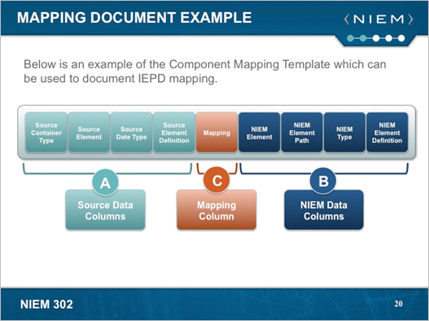

{{ page.description}}





# Build and Validate an IEPD

## Objective

This topic will help you to do the following:

- Create a mapping document and map your exchange data elements to the NIEM data model.
- Generate XML Schemas and other XML documents using NIEM tools.
- Validate XML Schemas to ensure NIEM Conformance.

## IEPD Lifecycle

- Scenario Planning

    During the Scenario Planning phase, you review background information related to your information exchange, assess resource impact, understand business context, and identify information exchange business scenarios.
- Analyze Requirements

    During the Analyze Requirements phase, the selected information exchange scenario is further elaborated to understand and document the business context and data requirements.
- Map and Model

    During the Map and Model phase, you create an exchange content model based on your information exchange requirements. The Exchange Content Model is then mapped to the NIEM data model.
- Build and Validate (this module)

    During the Build and Validate phase, you create a set of exchange-specific, NIEM-conformant XML schemas that implement the exchange content model created for the exchange.
- Assemble and Document

    During the Assemble and Document Phase, you prepare and package all related files for the IEPD into a single, self‐contained, self-documented, portable archive file.
- Publish and Implement

    During the last phase, the Publish and Implement phase, you implement the IEPD into production and publish the IEPD for search, discovery, and reuse.

## Define an Exchange Content Model

    Exchange Content Models are graphical representations of elements for an information exchange, as well as their associated relationships. Exchange Content Models consist of objects, elements, associations, and possibly cardinality.  

## Five Basic IEPD XML Schemas

- Exchange

    Also known as document or root schemas, define the root element and overall structure of the message.
- Extension

    Define the data types and elements that are not contained within NIEM but are needed for an information exchange.
- Subset

    Contain a smaller subset of elements and types from the NIEM reference schemas that are used and needed as part of an exchange.
- Constraint

    Apply a set of available business rules or logic to the elements and how they are represented.
- Reference

    Serve as the authoritative definition schema for the NIEM namespace.

## Other NIEM XML Artifacts

XML artifacts aid in the understanding and representation of an information exchange.

- XML Instances

    Used as example messages that validate against the previously defined IEPD schemas.
- Wantlists

    XML documents that specify the elements and types that are needed from NIEM and will be used in an exchange.
- Code lists

    Reference lists that are used to constrain values for a given element to a predetermined list.
- Stylesheets

    Provide formatting or transformation for the data used within an exchange.

## Lifecycle Phases

### Scenario Planning

During the Scenario Planning phase, you review background information related to your information exchange, assess resource impact, understand business context, and identify information exchange business scenarios.

### Analyze Requirements

During the Analyze Requirements phase, the selected information exchange scenario is further elaborated to understand and document the business context and data requirements.

### Map and Model

During the Map and Model phase, you create an exchange content model based on your information exchange requirements. The Exchange Content Model is then mapped to the NIEM data model.

### Build and Validate

During the Build and Validate phase, you create a set of exchange-specific, NIEM-conformant XML schemas that implement the exchange content model created for the exchange.

### Assemble and Document

During the Assemble and Document Phase, you prepare and package all related files for the IEPD into a single, self‐contained, self-documented, portable archive file.

### Publish and Implement

During the last phase, the Publish and Implement phase, you implement the IEPD into production and publish the IEPD for search, discovery, and reuse.

## IEPD Artifacts

Artifacts are the deliverables in the IEPD development process. Some artifacts are required while others are recommended.

The required and recommended artifacts associated with each phase of the IEPD lifecycle are highlighted here.

### Scenario Planning Artifacts

The artifacts associated with the Scenario Planning phase include Business Processes Diagrams, Use Case Diagrams, and Sequence Diagrams.

- Business processes diagrams provide a bridge between use cases and other business scenarios, such as Sequence Diagrams. Business processes provide background for how the exchange is currently being designed, so that other entities may leverage their exchanges through reuse.

- Use case diagrams depict the business level perspectives of the information exchange.

- Sequence diagrams represent the sequence of events that occur during an information exchange.

None of the artifacts indicated in this phase are required, but are recommended to better understand and document the business need.

### Analyze Requirements Artifacts

The artifacts associated with the Analyze Requirements phase include business rules and business requirements.

- Business rules define rules around how data is structured and represented as part of the exchange.

- Business requirements express business drivers or business needs for the exchange.

None of the artifacts indicated in this phase are required, but are recommended to better understand and document the business need.

### Map and Model Artifacts

The artifacts associated with the Map and Model phase include the Exchange Content Model and mapping document.

- Exchange Content Model is a graphical representation of the data and relationships involved in the information exchange.

- The mapping document is created to align elements identified in your exchange content model to the NIEM data model.

None of the artifacts indicated in this phase are required, but are recommended.

### Build and Validate Artifacts

The artifacts associated with the Build and Validate phase include subset schema, extension schema, wantlist, constraint schema, and exchange schema, among other artifacts such as reference schema and XML stylesheets. Typical artifacts you will see include the following:

- Subset schema is a subset of the NIEM schemas, whose components are taken entirely from the parent reference schema while excluding those components that are unnecessary for a given exchange.

- Exchange schema is a NIEM-conformant schema that describes the data to be exchanged. XML stylesheets show how the data in the XML message can be formatted to be presentable.

- Wantlist is a tool-specific construct used in the Subset Schema Generation Tool (SSGT) to save and reuse schema subsets of the overall NIEM data model. Simply, it is those items that you want from NIEM.

- Constraint schema restricts or constrains content that appears in instances of the subset schema.

- Extension schema is a NIEM conformant schema that defines data elements that are to be used in an exchange but do not exist in the NIEM data model, which therefore must be added to the schema. The exchange schema is a required artifact for this phase.

Note that a NIEM-conformant IEPD is required to contain at least one schema that is either a NIEM Reference Schema or a Subset Schema

### Assemble and Document Artifacts

The artifacts associated with the Assemble and Document phase include master document, catalog, change log, and sample XML instances.

- Master document is used to organize the required documentation and provide business and functional context of the information exchange.

- Catalog is a file that details the structure of the IEPD and links to each of the artifacts within the IEPD.

- Change log is a file representing all of the changes made to the schema files of a domain update.

- Sample XML instances are sample XML data that can be used to test the XML schemas.

The master document, catalog, change log, and sample XML instances are all required artifacts.

### Publish and Implement Artifacts

For the Publish and Implement phase, while no artifacts are required, you should publish the IEPD for search, discovery, and reuse, as well as implement the exchange.

As a best practice, include many of the artifacts listed here, not just the required ones.

### Maintain an Exchange

To maintain an IEPD, keep in mind the following:

- Ensure that any changes to an information exchange are correctly reflected within the IEPD.

- Establish a governance process within the organization to actively manage changes made to IEPDs. A governance process controls and prioritizes changes to information exchanges. The lack of a governance process can lead to problems related to multiple versions of an IEPD and a lack of awareness of changes that were implemented.

- Since the IEPD may be reused, it is critical to update IEPDs as changes are made. The change log and documentation within an IEPD should be updated whenever changes are made.

- When changes are made to an IEPD, publish the new version to the repository.

- Choosing to not maintain an IEPD inhibits reuse within and outside the organization.

## IEPD Content

### Mapping Documents in IEPD Development

#### Mapping Document

Mapping Documents are an important part of IEPD development. The Mapping Document is a document that identifies how exchange data aligns to, or "maps," and reuses NIEM data objects.

- It demonstrates how data within an exchange map to data objects in NIEM by documenting the degree of similarity.

- It aids in the identification process of objects that are not currently within NIEM and are candidates for inclusion in an Extension Schema, and potentially in NIEM in the future.

- It helps communicate the level of reuse in NIEM to business users/owners.

A mapping document can also be referred to as a Component Mapping Template, a Component Mapping Tool, or a Component Mapping Spreadsheet.

The mapping document is an effective tool for documenting how the NIEM data model was reused. A template is available for use on NIEM.gov.

The mapping document is a tool used to bridge the gap between exchange data and how that exchange data is represented in NIEM. The mapping document also identifies all objects from the exchange content model to determine where NIEM reuse can occur or where NIEM requires extension.

#### Mapping Document Example

Mapping Documents are commonly referred to as Component Mapping Templates (CMTs) and utilize spreadsheets with a common set of columns. Below is an example of a CMT, which is being used to document exchange to NIEM alignment.
The Source Data Columns describe the locally defined data that will be mapped to NIEM. This information was probably recorded when the Exchange Content Model was being built. Depending on the exchange, it is likely that each exchange partner will have different information for these columns with the end goal of all showing NIEM alignment. 
The Mapping Column documents the alignment of the “Source Data” and “NIEM Data.” This “mapping value” will aid in the decision to place which XML elements and types in which XML Schemas.
The NIEM Data Columns document the NIEM data objects to be reused in the IEPD’s XML schema. This means that for these cases, the NIEM element and type names will be used.
Note:
These or similar columns are the most commonly used for mapping documents. One of the goals of creating IEPDs is to promote reusability, and the more documentation available, the easier reuse becomes; therefore, more information is always helpful.

#### Exchange Content Model

As a data modeling tool, the Exchange Content Model should identify all of the data necessary for an exchange.  Objects in the exchange content model are represented in the Mapping Document. Associations and cardinality are not typically represented, but certainly can be, in the Mapping Document. You do not have to explicitly use data objects from the NIEM data dictionary, especially when depicting extension elements.

#### XML Schemas

After completing a Mapping Document, elements and types can be identified for inclusion in NIEM subset schemas or extension. Additionally, if a "container" data object (complex XML element) in NIEM is reused, the object will not be able to hold character data.

- Its Purpose

- The purpose and components of source data, NIEM data, and mapping columns

### The Mapping Process
