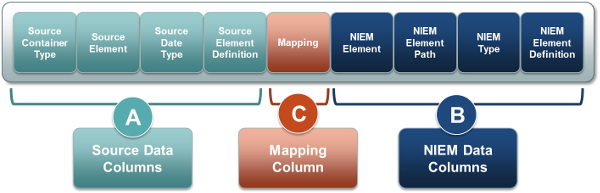
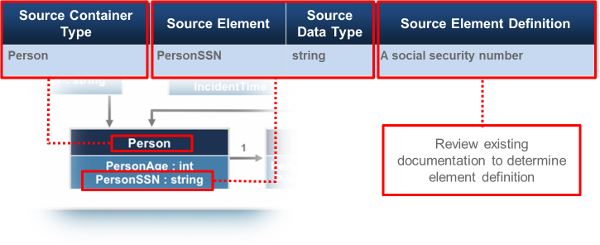

{{ page.description}}



# Mapping Process

## What is a Mapping Document?

The Mapping Document is a table or spreadsheet that identifies how existing exchange data aligns to (or maps) and reuses NIEM data objects. It is also referred to as a Component Mapping Template (CMT), Component Mapping Tool, or Mapping Spreadsheet. The document has the following characteristics:

- Demonstrates how the existing exchange data (or the **Exchange Content Model**) objects map to NIEM data objects by recording the degree of similarity.

- Helps to identify data objects that are not currently within NIEM as candidates for an **Extension Schema Document**.

- Helps to communicate the level of reuse of NIEM to business users and owners.

The following illustration shows the general structure of a mapping document.

## Setting Up a Mapping Document

Create a blank, nine-column table or spreadsheet with the headings shown in the previous illustration (Source Container Type, Source Element, etc.).

The next steps in setting up a mapping document are to identify (fill in) the **Source Data Columns**:

### Source Data Columns

1. Identify a data object within the exisiting exchange content model. This is the **Source Container Type** (the containing object to which elements belong).
1. Identify an element within that object. This is the **Source Element**.
1. Identify the data type for the element. This is the **Source Data Type**.
1. Provide a definition for the element. This is the **Source Element Definition**.
1. Repeat the previous steps for each object in the Exchange Content Model.

{:.example}
>Four columns should be filled in for every element within the exchange content model
>
>

### Mapping and NIEM Data Columns

When you complete setting up the Source Data Columns, identify the NIEM elements that may have the same logical definition, semantics, and structure as the source elements.

The **Mapping** value is the degree to which a source element maps to a NIEM element. Possible values are the following:

| Value | What It Means |
| --- | --- |
| Equivalent | Semantics and structure map exactly or almost exactly.  The NIEM data object’s name and definition should have exactly the same conceptual meaning as the exchange data object. |
| Partial | Partial Match is where you can take some things from NIEM and have to extend the rest for a given Type. In other words, when the semantics or structure of an exchange and NIEM data objects do not exactly fit. |
| No Match | No exchange element or type maps to NIEM.  The result is an extension to NIEM through an IEPD extension schema. |

1. Use a NIEM tool (e.g., Schema Subset Generation Tool (SSGT)) to find an element from a NIEM reference schema that “maps” to the exchange data element. In this example, look for a "Property" with "personSSN" as the search string.
1. If nothing is found that looks like a match, try searching by name, for synonyms, conceptual meaning, or by type. In this example, a possible match is found. ")
1. Enter the match in the mapping document under "NIEM Element." ")
1. Map objects that are conceptually and semantically equivalent. If the alignment is not easily understood, it is better to extend.
1. Document the information about the NIEM data object, including the type of mapping (equivalent, partial, no match) if one is found. In this example, enter the type under "NIEM Type." ")
1. Click the **Add** button to begin the schema-creation process and to identify an element path. ")
1. Note the **Types** and **Elements** areas are populated when the **Add** button is clicked. ")
1. The "NIEM Element Path" becomes the following: ")
1. With the information you have now, you can begin the schema-generation and validation process.

### Model Searching Tips

Searching the NIEM model can be difficult, but these methods can help. Note that the tactics that work using web search engines (like Google or Yahoo) also work with the search tools for the NIEM model.

| Search Method | Explanation | Example |
| --- | --- | --- | --- |
| Name Variations | Searching for variations of a name can often yield results. | Search for **Officer** instead of **Official** to yield **j:EnforcementOfficial**. |
| Conceptual Meaning | Search for words that could be in the definition of the data object. | Search for **Modified Charge** to yield **j:AmendedCharge**. |
| Synonyms | Synonyms of the data object to find exactly what you seek. | Search for **Facility** instead of **Building** to get different results. |
| Containers | Use a more abstract term to find containers of the data objects. | Search for **Person** instead of **Person Arrest** to get the maximum number of results. |

### Notes on Reuse of the NIEM Data Model

The hierarchical implications of the model must be considered when reusing NIEM elements. NIEM’s hierarchal approach to modeling allows for flexibility and reuse, while still maintaining context.

- Elements and types are defined globally and referenced when used.

- Type hierarchy provides a contextual representation of the element.

- Attributes are assigned to some types to provide context on their use.

")

### Final Considerations

You should include additional notes in the mapping document to provide reasoning and context. When mapping, be conservative in extending NIEM data objects to maintain the integrity of the NIEM data model.

## Appendix

### Source Data Columns (A)

| Source Container Type | Source Element | Source Data Type | Source Element Definition |
| --- | --- | --- | --- |
| The data source high-level object, class, or context of a set of data elements (e.g., person, vehicle, arrest) | The source element is a specific data element that is associated with the Source Container Type | Data type of the source element | The definition of the source element being mapped |
| **Example** |
| Person | DateofBirth | Date | Date of birth of a person |

### NIEM Data Columns (B)

| NIEM Element | NIEM Element Path | NIEM Type | NIEM Element Definition |
| --- | --- | --- | --- |
| The name of the NIEM element the source element is mapped to | The path of the NIEM Element within the NIEM Model | The name of the type that is associated with the NIEM element | The standard definition for the NIEM element found in the element’s metadata |
| **Example** |
| nc:PersonBirthDate | nc:Person/nc:PersonBirthDate | nc:DateType | A date a person was born |

### Mapping Column (C)

In a Mapping Document, you must search the NIEM model for appropriate data elements to map to local exchange data. If a NIEM element is found, the correlation of the source and NIEM elements is recorded here.

| Mapping |
| --- |
| Identifies how the source object or element maps to the NIEM object or element. |
| **Example** |
| Equivalent |

{:.note}
>Equivalent Match
>
>- If a NIEM object has similar semantics and structure to an exchange data object, it is probably an equivalent match.
>- Equivalent matches can be difficult to find due to complex containers and different names.
>- As a first check, verify that the NIEM data object’s definition and its containing objects logically align to the exchange object.

{:.example}
>Equivalent Match
>
>| Exchange Data | NIEM Data Objects |
>| --- | --- |
>| Person | nc:Person |
>| Person Name | nc:Person/nc:PersonName |
>| Person First Name | nc:Person/nc:PersonName/nc:PersonGivenName |

{:.note}
>Partial Match
>
>- This match is the most difficult mapping to find in the NIEM data model. It is the gray area that exists between **Equivalent** and **No Match**.
>- Most partial matches can be categorized into three conflict categories:
>   - Semantic
>   - Structural
>   - Container
>- Mitigations exist for each of these three categorizes that will maintain the integrity of the NIEM data model.
>- In spite of these mitigations, there are cases where an exchange object will not map to the NIEM data model.

{:.example}
> Partial Match
>
> | Conflict Description | Example(s) | Mitigation |
> | --- | --- | --- |
> | **Semantic:** Occurs when there is a small discrepancy in definition or name. | **nc:Date** does not align exactly with **local-ns:EntryDate** | Reuse the NIEM data type and create a local element. |
> | **Structural:** Occurs when the NIEM data object has constraints that disallow a direct mapping of the exchange data object. | Data type mismatches. Code lists (enumeration facets) do not have all necessary entries. | Reuse the NIEM element and either create a new data type or extend a NIEM base type. |
> | **Container:** Occurs when an exchange data object hierarchy does not match the hierarchy of a desired NIEM data object. | Data object contains (or is contained within) elements or types that do not make logical sense or align well. | Reuse the NIEM element or type but create local elements or types to contain them. |

{:.note}
>No Match
>
>- Similar to some partial matches, the result is an extension to NIEM contained in an IEPD extension schema.
>- When a **No Match** occurs, a new element is created for the exchange object.
>- A number of obvious cases will almost always have a **No Match**:
>   - Specific local information, such as code tables (enumeration facets).
>   - A “new” government or private sector issue or data object that has not made it into the model.
>   - Uncommon data, such as something very specific to a particular organization.

{:.example}
>No Match
>
>| Exchange Data | Mapping Value* | NIEM Data Objects |
>| --- | --- | --- |
>| Cargo Ship | Partial Match | nc:Vessel |
>| Hazmat Indicator | No Match | nc:Vessel/local ns:HazmatIndicator |

\* **Mapping Value** is intended to show the difference between a Partial Match and No Match.
