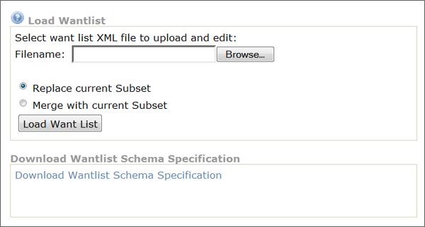
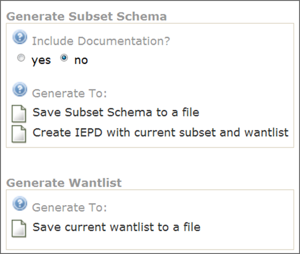

{{ page.description}}



# Create XML Schemas and Artifacts

Data objects identified in the mapping document will appear in either the exchange, extension, or subset schemas. Associations and cardinality from the exchange content model will be reflected in XML schemas.

## NIEM-Conformant XML Schema Generation

XML schemas that are typically created for an IEPD include subset, exchange, extension, constraint, and reference. A NIEM-conformant IEPD is required to constrain at least one schema that is either a NIEM reference schema or subset schema. XML schemas for NIEM-conformant exchanges can be created in two ways:

| Method | Process |
| --- | ---|
| Generation Through Tools | Automatically generate schemas based on an exchange content model, mapping document, or other inputs. |
| Coded by Hand | Start with existing schemas or NIEM schema templates, which can be derived from NIEM reference schemas. |

It is recommended that you start with tools and modify as needed.

### The NIEM Tools Catalog

The NIEM Tools catalog provides a marketplace for a number of different tools that aid in schema generation. The **Code List Generator**, for example, provides you with the ability to build an XML schema file for code sets from an Excel spreadsheet.

The NIEM Tools Catalog resides at [NIEM Tools Catalog](https://www.niem.gov/tools-catalog "NIEM Tools Catalog").

The Code List Generator resides at [Code List Generator Tool](https://www.niem.gov/CLG "Code List Generator Tool")

### Create a Subset Schema

Subset schemas are constructed by reusing the elements and types needed for the exchange from NIEM reference schemas.

### Subset Schema Considerations

- A subset schema is a required artifact of an IEPD and should be NIEM-conformant.

- A subset schema should always validate against the entire reference schema.

- A subset schema can be generated using a number of tools from a variety of inputs (e.g., Wantlists, XMI files).

### Subset Schema Generation Tool (SSGT)

The Subset Schema Generation Tool (SSGT) is a common starting point for schema development because it is free, easy to use, and produces Subset Schemas for use within an exchange. The SSGT can also be used for searching and browsing the NIEM data model and generating Wantlists.

### Wantlist

A Wantlist is essentially an XML file that describes what an exchange “wants” from the NIEM data model. It directly aligns to the subset schema. SSGT also provides the functionality to generate a subset schema based on a Wantlist.

#### Using a Wantlist

Wantlists are primarily used to generate a subset schema for a particular information exchange. Elements and types that have been mapped to NIEM are included as part of the wantlist. The types and elements that are part of the wantlist represent those elements that are going to be part of the subset schema.

### Wantlist Procedure

1. Load Wantlist into SSGT. 

1. Generate Subset Schema. 

### Constraint Schemas

Constraint schemas add additional restrictions to elements and types in the exchange with the following considerations:

- They not a required artifact of an IEPD and do not have to be NIEM-conformant.

- They are derived from Subset Schemas.

- They reflect the business rules of the exchange.

If a separate schema is developed, an additional validation path is needed to validate against the Constraint Schema.

### Extension Schemas

Extension Schemas define exchange specific types, elements, and attributes not available within NIEM. The Extension Schema also includes reusable data components for a given exchange with the following considerations:

- They are not a required artifact of an IEPD (it is possible for an IEPD to just have an Exchange Schema and a Subset Schema).

- If the data objects in the Extension Schema will be reused, it is better to have a separate schema and local namespace defined for that schema.

- Exchange Schemas cannot be reused effectively between information exchanges because they contain the root element of the information exchange, which is unique to each individual exchange.

### Exchange Schemas

An Exchange Schema defines the root (highest level) element of the exchange, as well as any other content specific to this IEPD that will not be reused by other IEPDs. It has the following chararacteristics:

- It is required in an IEPD.

- It imports, reuses, and arranges the data objects from other schemas in the exchange.

- It is unique to each exchange.

- When it is reused from existing exchanges, it can provide a template for the structure and content of the new exchange schema.

{:.note}
> An IEPD may have multiple exchange schemas. This is due to the fact that multiple information exchanges may be documented through a single IEPD where each information exchange has its own exchange schema, but shares a common extension schema.

### Recommended Additional XML Artifacats

In addition to exchange, extension, subset, and constraint schemas, there are four additional XML artifacts that you should include within an IEPD. These are labeled “XML Artifacts” because they are not part of the four major schemas included in an IEPD, covered previously. However, they are highly recommended. The file extensions on these “artifacts” include XML, XSD, and XSL; therefore, not all of these artifacts are XML schema (XSD).

| Artifact | Description |
| --- | --- |
| Wantlists | An XML file that contains the elements and types from NIEM that will be included within the Subset Schema for the exchange. |
| Stylesheets | A stylesheet is built using eXtensible Stylesheet Language (XSL) and is used to make an XML instance human (or browser) readable. |
| Instances | A sample XML instance is defined as the exchange message  “payload” and validates against the IEPD schemas. |
| Code Lists | An XML schema of a list of allowable values for a data element within an exchange. |

## Validate XML Schemas
